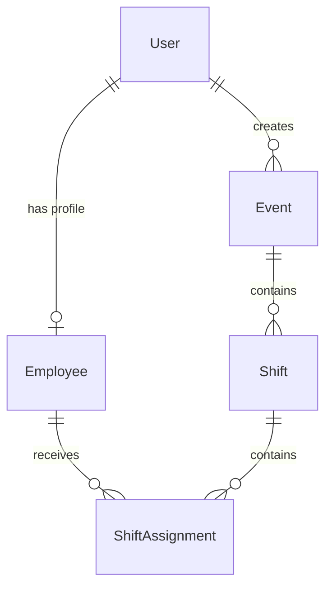

# ShiftFlow

ShiftFlow is a production-style workforce and event staffing management SaaS built with Next.js App Router, TypeScript, PostgreSQL, Prisma, Auth.js, and Zod.

## Overview

Staffing teams need a clean way to manage events, build shifts, assign employees, and keep staffing coverage visible. ShiftFlow focuses on that operational workflow with server-side authorization, business-rule validation, and a feature-oriented codebase that is easy to explain in a technical interview.

## Problem

Operational staffing work often lives across spreadsheets, chat threads, and ad hoc docs. That makes it hard to answer basic questions:

- Which events are upcoming?
- Which shifts are understaffed?
- Which employees are active?
- Which assignments overlap?

## Solution

ShiftFlow centralizes event planning and staffing operations in one dashboard:

- Managers create and manage events
- Managers create shifts with capacity constraints
- Managers create employee accounts and deactivate employees safely
- Managers assign employees to shifts with overlap and capacity validation
- Employees view only their own upcoming shifts and event details

## Features

- Role-based authentication with manager and employee roles
- Protected App Router pages and server-side authorization checks
- Events, employees, shifts, assignments, schedule, and dashboard views
- Zod validation for auth and core business forms
- Assignment conflict handling for duplicates, inactive employees, overlap, and capacity
- Prisma seed data for a realistic development environment

## Screenshots

Add screenshots here after running the seeded app locally.

## Tech Stack

- Next.js 16 App Router
- React 19
- TypeScript 5
- Tailwind CSS 4
- PostgreSQL
- Prisma ORM 7 with `prisma-client` and `@prisma/adapter-pg`
- Auth.js via `next-auth`
- Zod
- Vitest
- Playwright
- Docker Compose
- GitHub Actions

## Architecture

```text
src/
  app/
    (auth)/
    (dashboard)/
    api/
  components/
    layout/
    ui/
  features/
    assignments/
    auth/
    dashboard/
    employees/
    events/
    shifts/
  lib/
    auth.ts
    db.ts
    generated/prisma/
    utils.ts
prisma/
tests/
```

### Why feature-oriented architecture

Business logic is grouped by domain so events, employees, shifts, and assignments can evolve independently without turning `app/` or `lib/` into dumping grounds. Shared UI stays in `components`, route ownership stays in `app`, and domain logic stays close to the feature that uses it.

### Why PostgreSQL

ShiftFlow models relational data with real constraints:

- users to employees
- events to shifts
- shifts to assignments

PostgreSQL fits that shape well and supports the indexing and integrity rules the app needs in production.

### How authorization works

- Authentication uses email/password credentials with hashed passwords
- Sessions include `id`, `name`, `email`, `role`, and `employeeId`
- Server helpers such as `requireUser`, `requireManager`, and `requireEmployeeSelf` protect routes and mutations
- UI visibility is helpful, but access control is enforced on the server

### How overlapping shifts are prevented

When a manager assigns an employee to a shift, the server loads the employee’s active assignments and checks the target shift window against existing shift windows. If any overlap is found, the assignment is rejected by default.

### Why employees are deactivated instead of deleted

Deleting employees would destroy staffing history and make past assignment reporting less trustworthy. Deactivation preserves historical integrity while preventing new work from being assigned to inactive staff.

## Database Model

### Core entities

- `User`
- `Employee`
- `Event`
- `Shift`
- `ShiftAssignment`

### Relationships

- A `User` can be a manager or employee
- An `Employee` belongs to one `User`
- An `Event` is created by a manager user
- A `Shift` belongs to one `Event`
- A `ShiftAssignment` links one employee to one shift

### Mermaid ER Diagram



## Getting Started

### 1. Install dependencies

```bash
npm install
```

### 2. Configure environment variables

Copy `.env.example` values into a local `.env` file and update as needed.

### 3. Start PostgreSQL with Docker

```bash
docker compose up -d
```

### 4. Generate Prisma client

```bash
npm run prisma:generate
```

### 5. Run migrations

```bash
npm run prisma:migrate
```

### 6. Seed the database

```bash
npm run prisma:seed
```

### 7. Start the app

```bash
npm run dev
```

## Environment Variables

```env
DATABASE_URL=
AUTH_SECRET=
NEXTAUTH_URL=
```

## Database Setup

The default Docker setup exposes PostgreSQL on `localhost:5432` with:

- database: `shiftflow`
- user: `postgres`
- password: `postgres`

## Testing

```bash
npm run test
npm run test:e2e
```

Playwright E2E runs assume:

- the database is migrated
- the seed has been executed
- `E2E_READY=1` is set

## Docker

Use `docker compose up -d` to run PostgreSQL locally.

## Deployment

For deployment, configure a hosted PostgreSQL instance, set the environment variables, run Prisma migrations, and deploy the Next.js app to your preferred platform.

## Future Improvements

- Employee self-service confirmation or decline flows
- Richer schedule filters and weekly timeline interactions
- Audit logging for staffing changes
- Email notifications for assignments and schedule changes
- Pagination and search across larger datasets
